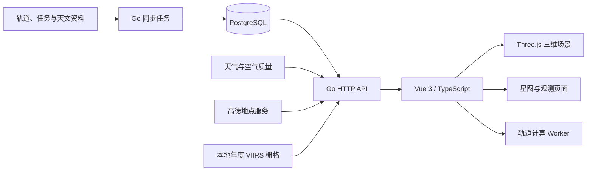

<div align="center">

# AURORA

**从太阳系到你头顶的夜空**

一个融合三维宇宙探索、航天任务与本地天文观测的交互平台。

Vue 3 · TypeScript · Three.js · Go · PostgreSQL

[深空探索](#深空探索) · [天文观测](#天文观测) · [技术架构](#技术架构) · [本地运行](#本地运行)

</div>

---

AURORA 将两种看宇宙的方式放进同一个空间：向外，探索太阳系、行星、卫星与深空探测器；向上，了解所在地的夜空、天气、月光与值得观察的天象。

它既是一套可以自由转动、缩放与切换视角的三维场景，也是一套由轨道数据、星历计算、天气预报和天文资料驱动的完整前后端应用。页面保留资料来源、数据时间与任务背景，让可视化与真实信息相互连接。

## 深空探索

### 太阳系总览

在统一的三维空间里浏览太阳与八大行星，查看天体资料及深空探测任务。支持示意布局与真实位置模式，通过连续的镜头转场进入各个天体，再返回原来的观察视角。

- 太阳、地球、月球、火星及其他主要行星的独立特写场景。
- 自由旋转、缩放、目标聚焦与场景图层控制。
- 行星表面、云层、夜景、光照、光环与任务标记。
- 深空探测器路径、任务阶段、目的地及任务档案。
- 航天器与着陆点标签随距离调整，在密集位置聚合展开。

### 地球与轨道活动

以三维地球展示近地空间中的航天器、轨道、发射场与发射计划。

| 功能 | 内容 |
| --- | --- |
| 航天器位置 | 根据公开 OMM 轨道根数，通过 SGP4 推算随时间变化的位置 |
| 轨道图层 | 在地球周围查看轨迹，聚焦并跟随选中的目标 |
| 航天器目录 | 中文名称、任务资料、运营方，支持关键词、正则查询、筛选与分页 |
| 发射场 | 在真实经纬度位置标注发射设施，展开地点资料 |
| 发射计划 | 查看近期发射时间、任务状态与来源，提供中文整理字段及原文 |
| 观测位置 | 浏览器定位或手动设置地点，并在地球视图中聚焦 |

轨道位置由轨道模型推算，任务档案保留历史任务与在途阶段的区别。

### 月球、火星与行星任务

月球与火星场景连接轨道飞行器、着陆点和任务资料；其他行星场景展示对应的探测历史与代表性任务。

- 月球轨道器、月面着陆点与任务目录。
- 火星轨道器、着陆器、巡视器及表面任务位置。
- 行星探测器、飞掠/绕行路径与阶段说明。
- 天体档案、表面标注与相关任务详情。
- 土卫六与惠更斯号的独立任务视图。

## 天文观测

### 观星条件

从所在地出发，将天气、月光与夜空背景集中到一个观测页面。

- 浏览器设备定位、高德地名搜索、逆地理编码与手动经纬度设置。
- 当前天气以及今天、明天的逐小时预报。
- 云量、降水、湿度、风速、能见度与空气质量信息。
- 今夜与明夜的观测评分、推荐时间窗口和观测建议。
- 月相、月光与日出日落等时间信息。
- 根据年度 VIIRS 栅格展示辐射值与估算的 SQM、Bortle 光污染等级。

观测评分随天气预报与月光条件变化；光污染作为地点的长期环境参考单独展示。预报和估算有各自的数据时间与适用范围。

### 第一视角星图

按地点和时间计算天空中天体的位置，用第一视角探索夜空。

- 查看恒星、太阳、月球与行星，搜索并聚焦目标。
- 昨天、今天、明天的天空预览与时间调节。
- 天体轨迹、方向与地平线关系。
- 点击天体查看详情，并高亮其在当前天空中的轨迹。
- 从观测建议跳转到对应时刻和目标。
- 使用观测点的时区处理自然日与跨日轨迹。

### 天象日历

将本地计算与外部权威资料结合，展示月球周期、季节节点、日月食、流星雨和行星相关事件。

事件详情提供时间、来源与地点可见性；日食可根据 NASA 贝塞尔根数计算本地接触时刻与食分。后端保存事件与来源快照，页面通过统一 API 获取资料。

### 宇宙图像

NASA Astronomy Picture of the Day 与专题图片墙提供另一种探索宇宙的入口。

- 每日图片、历史内容与 NASA 图库及其他天文影像来源。
- 标题、说明、原始发布日期、署名与使用信息。
- 原始页面和图片链接。
- 图像内容校验、缓存与失败重试；APOD 返回品牌图时从官方正文恢复有效图片。

## 交互与性能

AURORA 以电脑浏览器为主要体验场景，支持鼠标与键盘操作。

- 页面和栏目使用 hash 路由，刷新保留当前入口。
- 太阳系主场景复用，隐藏时暂停渲染。
- 卫星位置与密集轨道计算交给 Web Worker，主线程插值显示。
- 贴图采用预览与高清分级，按场景需要加载。
- 根据持续帧时间压力动态调整渲染分辨率。
- 标签与镜头逐帧同步，场景资源按生命周期管理。
- 入场、退出与天体间转场保持连续的空间体验，并支持减少动态效果偏好。

## 技术架构



| 层级 | 技术与职责 |
| --- | --- |
| 前端 | Vue 3、TypeScript、Vite；页面、路由、交互与状态管理 |
| 三维渲染 | Three.js；天体、轨迹、光照、镜头和标注 |
| 天文与轨道计算 | astronomy-engine、satellite.js / SGP4、Web Worker |
| 后端 | Go、chi；数据查询、天气、地点、评分、事件与图像接口 |
| 数据存储 | PostgreSQL、pgx；任务资料、轨道、事件、来源快照与缓存 |
| 数据维护 | SQL 自动迁移、启动同步、周期同步、超时与防重叠机制 |

后端先提供缓存和健康接口，再异步同步外部资料。每次同步保留来源、时间与结果；上游失败时保留已有有效数据。

## 数据来源

| 来源 | 用途 |
| --- | --- |
| CelesTrak | 地球航天器 OMM 轨道根数 |
| Launch Library 2 | 发射计划与任务状态 |
| JPL Horizons | 月球、火星、深空探测器轨道与行星星历 |
| Open-Meteo | 天气预报与空气质量 |
| 高德 Web 服务 | 地点搜索、坐标转换与逆地理编码 |
| NASA / GSFC | 日月食资料与日食计算数据 |
| USNO、IMO、IAU MDC、JPL 小天体资料 | 月球周期、季节、流星雨与相关天象资料 |
| NASA APOD、NASA Image Library、ESA / ESO 等 | 天文图片与元信息 |
| NASA Black Marble / VIIRS | 年度光污染环境参考 |

外部资料与图像的权利归各自作者和机构所有；页面保留署名与来源。星历与轨道预测、天气预报、光污染估算和历史任务资料按各自模型与数据时间解释。

## 本地运行

### 环境

- Node.js 与 pnpm。
- Go 1.26 或更高版本。
- PostgreSQL；本地开发使用 PostgreSQL 17。
- 可访问所需外部数据源的网络。

### 1. 准备数据库与配置

```sh
createdb aurora
cd backend
cp .env.example .env
```

在 `backend/.env` 中设置：

| 变量 | 说明 |
| --- | --- |
| `PORT` | API 端口，默认 `8080` |
| `DATABASE_URL` | PostgreSQL 连接地址；默认连接本机 `aurora` 数据库 |
| `AMAP_WEB_KEY` | 高德 Web 服务 Key，用于地点查询 |
| `NASA_API_KEY` | NASA API Key，用于 APOD |
| `LIGHT_POLLUTION_DATA_PATH` | 本地 VIIRS 栅格路径 |

密钥只留在后端环境中，`.env` 不提交到 Git。光污染资源准备见 [VIIRS 数据说明](backend/data/light-pollution/README.md)。

### 2. 启动后端

在 `backend/` 目录运行：

```sh
go run ./cmd/api
```

后端自动执行尚未应用的数据库迁移，提供 `http://localhost:8080/api/health`，并在后台同步资料。

### 3. 启动前端

另开终端，在项目根目录运行：

```sh
cd frontend
pnpm install
pnpm dev
```

访问 **http://localhost:5173/aurora/**。Vite 将 `/api` 请求代理至后端；浏览器会在需要时申请定位权限。

### 4. 检查与构建

```sh
# 项目根目录
cd frontend
pnpm test
pnpm build

cd ../backend
go test ./...
go build ./cmd/api
```

## 项目结构

```text
AURORA/
├── frontend/
│   ├── src/components/       三维场景与观测界面
│   ├── src/orbit/            地球轨道与后台计算
│   ├── src/solar/            太阳系场景、数据与纹理
│   ├── src/assets/           贴图、字体与图像资源
│   └── tests/                前端计算与交互回归测试
└── backend/
    ├── cmd/api/              服务入口
    ├── internal/httpapi/     HTTP API
    ├── internal/orbit/       地球航天器与发射资料
    ├── internal/moon/        月球资料
    ├── internal/mars/        火星资料
    ├── internal/voyage/      深空任务
    ├── internal/observatory/ 天气、月相、评分与可见性
    ├── internal/astronomyevent/ 天象与来源同步
    ├── internal/dailyimage/  APOD 与图像墙
    ├── internal/location/    地点服务
    ├── internal/syncer/      轨道与任务同步
    └── internal/database/    PostgreSQL 与迁移
```

**AURORA：在同一个界面里，探索远方的宇宙，理解身边的夜空。**
